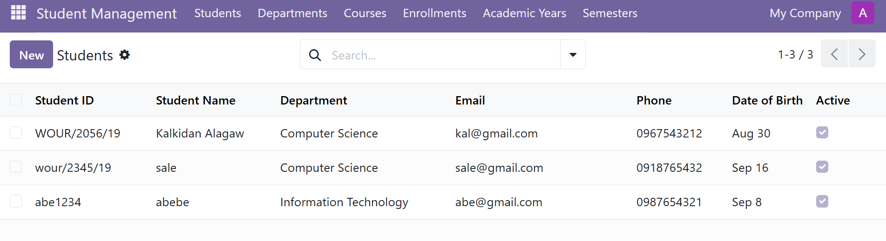
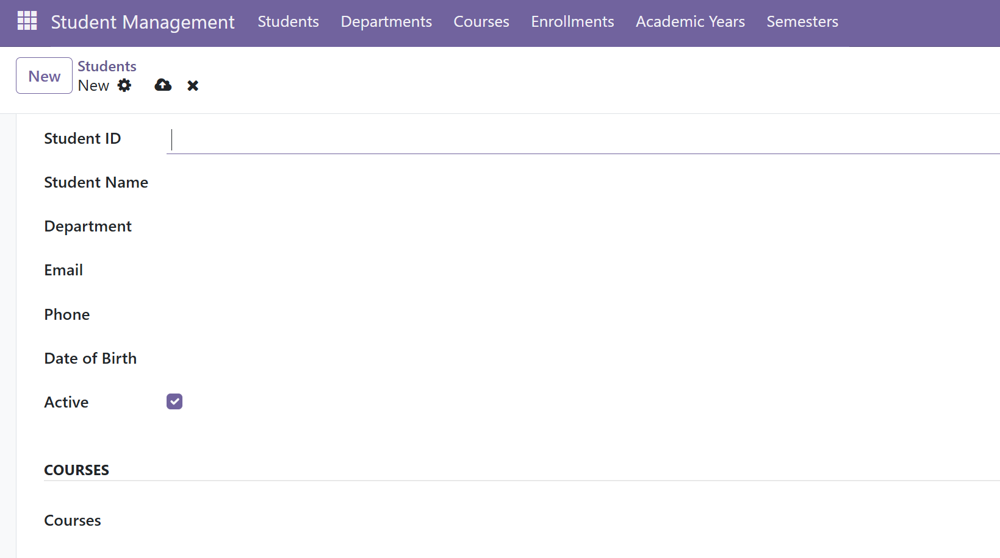
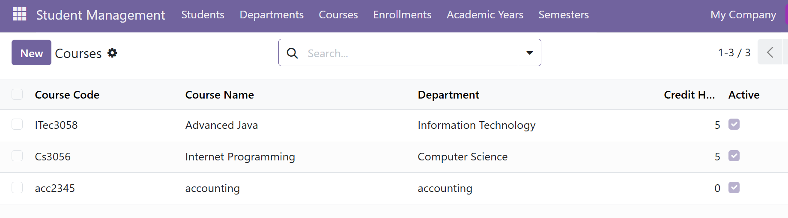
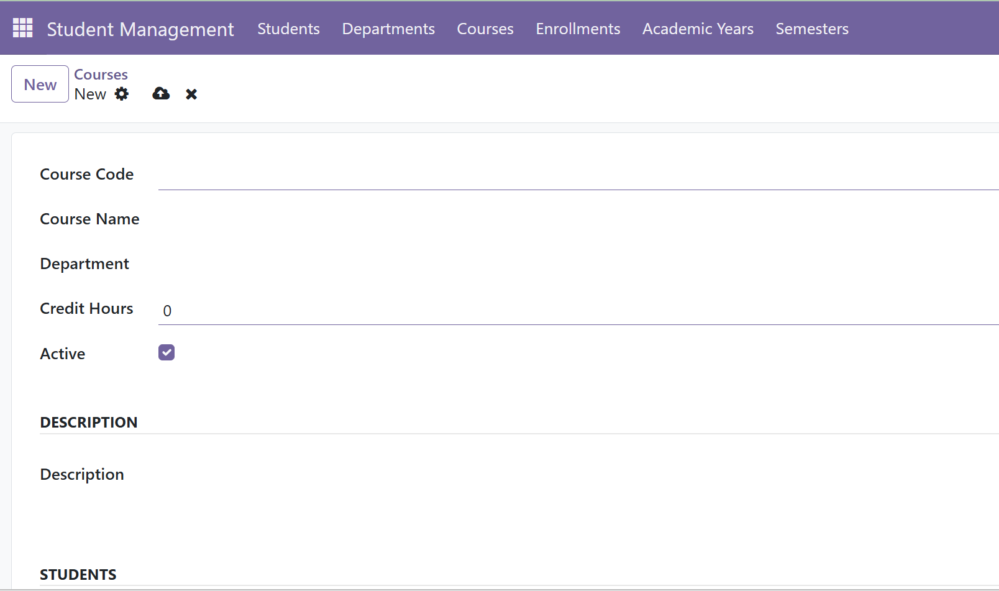
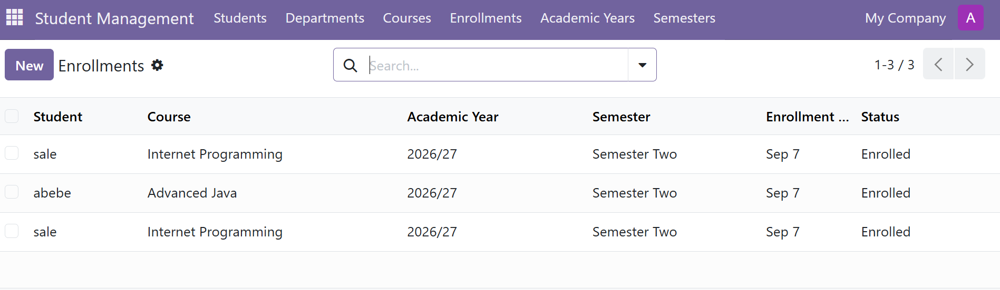

# Student Management System – Odoo 19

A custom Student Management System developed using **Odoo 19 Community Edition**.

The system is designed to manage students, departments, courses, academic years, semesters, and student enrollments while maintaining consistent relationships between students and their courses.

## 🚀 Project Overview

This project demonstrates the development of a custom Odoo module using Python, XML, PostgreSQL, and the Odoo ORM framework.

The system manages the academic relationship between:

```text
Student
   │
   ├── Department
   │
   └── Courses
          │
          └── Enrollment
                 ├── Academic Year
                 ├── Semester
                 ├── Enrollment Date
                 └── Status
```

## ✨ Main Features

* Student management
* Department management
* Course management
* Academic year management
* Semester management
* Student–Course Many2many relationship
* Student enrollment management
* Automatic synchronization of student courses
* Enrollment create/update/delete handling
* Enrollment status management

### Enrollment Status

The system supports:

* Enrolled
* Completed
* Dropped

## 🔄 Enrollment Synchronization

One of the key features of the system is the automatic synchronization between the Enrollment model and the Student–Course Many2many relationship.

When an enrollment is created:

```text
Student + Course
       ↓
Enrollment Created
       ↓
Course automatically added
to Student's Courses
```

When an enrollment is updated:

```text
Old Student/Course
       ↓
Old relationship checked
       ↓
New Student/Course
       ↓
Many2many relationship synchronized
```

When an enrollment is deleted:

```text
Enrollment Deleted
       ↓
Check for other enrollments
       ↓
If no other enrollment exists
       ↓
Course removed from Student
```

This prevents the Enrollment and Student Course information from becoming inconsistent.

## 🛠️ Technologies

| Technology | Purpose                     |
| ---------- | --------------------------- |
| Odoo 19    | ERP/Application Framework   |
| Python     | Backend development         |
| XML        | Views and UI configuration  |
| PostgreSQL | Database                    |
| Odoo ORM   | Database and business logic |
| Git        | Version control             |
| GitHub     | Source code management      |

## 📂 Module Structure

```text
student_management/
│
├── __init__.py
├── __manifest__.py
│
├── models/
├── views/
├── security/
└── data/
```

## ⚙️ Development Environment

The project was developed using:

* Odoo 19 Community Edition
* PostgreSQL 17
* Python
* Windows development environment
* Visual Studio Code
* Git/GitHub

## 🧪 Testing

The Enrollment functionality was tested for:

* Creating an enrollment
* Updating a student
* Updating a course
* Deleting an enrollment
* Maintaining Student–Course relationships
* Preventing duplicate enrollments
* Preserving relationships when another enrollment still exists

## 📸 Screenshots

## Screenshots

### Student Management



### Student Form



### Course Management



### Course Form


### Enrollment


## 🎯 Future Development

Planned functionality includes:

* Student results and grades
* Attendance management
* Teacher management
* Assignment management
* Student performance tracking
* Notifications
* Student portal
* Reporting and dashboards
* Academic transcript generation

## 👨‍💻 Author

Developed as a practical Odoo development project to demonstrate custom module development, ORM programming, relational modeling, and business workflow automation.

## 📄 License

This project is intended for educational and development purposes.

