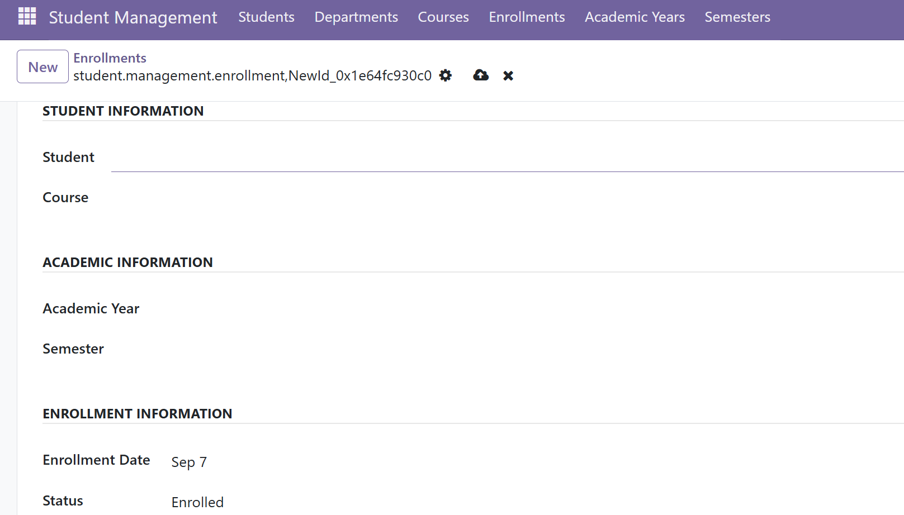

🎓 Student Management System — Odoo 19

A custom academic management module built from scratch with Odoo 19, Python, XML, PostgreSQL, and the Odoo ORM.

🚀 What is this?

The Student Management System is a custom Odoo 19 module designed to manage the core academic activities of an educational institution.

Instead of treating students, courses, and enrollments as isolated records, the system models their relationships and keeps them synchronized automatically.

🎯 Core workflow
                    ┌─────────────────┐
                    │     Student     │
                    └────────┬────────┘
                             │
              ┌──────────────┴──────────────┐
              │                             │
       ┌──────▼──────┐               ┌──────▼──────┐
       │ Department  │               │   Courses   │
       └─────────────┘               └──────┬──────┘
                                            │
                                    ┌───────▼────────┐
                                    │   Enrollment    │
                                    └───────┬────────┘
                                            │
                         ┌──────────────────┼──────────────────┐
                         │                  │                  │
                  Academic Year         Semester           Status
✨ Key Features
Feature	Description
👨‍🎓 Student Management	Create and manage student records
🏫 Department Management	Organize students by department
📚 Course Management	Create and manage academic courses
📅 Academic Years	Manage academic-year information
🗓️ Semester Management	Organize courses by semester
🔗 Student–Course Relationship	Many2many relationship between students and courses
📝 Enrollment Management	Register students into courses
🔄 Automatic Synchronization	Enrollment automatically updates student courses
🛡️ Duplicate Prevention	Prevent duplicate enrollment for the same academic period
📊 Enrollment Status	Enrolled, Completed, or Dropped
🔥 Highlight Feature — Smart Enrollment Synchronization

One of the most important parts of this project is the relationship between:

Student ↔ Course ↔ Enrollment

The system doesn't simply create an enrollment record. It also keeps the Student's course information synchronized with enrollment records.

➕ When an enrollment is created
Student + Course
       │
       ▼
Enrollment Created
       │
       ▼
Course automatically
added to Student
🔄 When an enrollment is updated
Old Student / Course
        │
        ▼
Check existing relationships
        │
        ▼
Update Enrollment
        │
        ▼
Synchronize Many2many
relationship
🗑️ When an enrollment is deleted
Enrollment Deleted
        │
        ▼
Check for other enrollments
        │
        ├── YES ──► Keep Course
        │
        └── NO ───► Remove Course
                     from Student

This prevents the Enrollment model and the Student–Course relationship from becoming inconsistent.
🖥️ Screenshots

Explore the system through the screenshots below.

👨‍🎓 Student Management

Student Form

📚 Course Management

Course Form

📝 Enrollment Management

Enrollment Form

student_management/
│
├── __init__.py
├── __manifest__.py
│
├── models/
│   ├── __init__.py
│   ├── student.py
│   ├── department.py
│   ├── course.py
│   ├── academic_year.py
│   ├── semester.py
│   └── enrollment.py
│
├── views/
│   └── student_views.xml
│
├── security/
│   └── ir.model.access.csv
│
├── screenshots/
│   ├── student_list.png
│   ├── student_form.png
│   ├── course_list.png
│   ├── course_form.png
│   ├── enrollment_list.png
│   └── enrollment_form.png
│
└── README.md

🛠️ Technology Stack
Backend
🐍 Python
🧩 Odoo ORM
Application Framework
🟣 Odoo 19 Community Edition
Frontend / UI
📄 XML
Odoo Views
Database
🐘 PostgreSQL 17
Development Tools
💻 Visual Studio Code
🔀 Git
☁️ GitHub

## ⚙️ Development Environment

The project was developed using:

* Odoo 19 Community Edition
* PostgreSQL 17
* Python
* Windows development environment
* Visual Studio Code
* Git/GitHub
🧪 Testing

The Enrollment workflow was tested against the following scenarios:

✅ Create enrollment
✅ Update student
✅ Update course
✅ Delete enrollment
✅ Synchronize Student–Course relationship
✅ Prevent duplicate enrollment
✅ Preserve course relationship when another enrollment exists

The testing focused particularly on maintaining data consistency between related Odoo models.
📈 What This Project Demonstrates

This project demonstrates practical experience with:

* Odoo custom module development
* Python backend programming
* Odoo ORM
* Many2one relationships
* Many2many relationships
* Related fields
* CRUD operations
* create() customization
* write() customization
* XML view development
* Access control
* Relational database modeling
* Business workflow automation
🔮 Future Development

The system can be expanded into a more complete academic ERP solution.

Planned features
📊 Student results and grades
📅 Attendance management
👨‍🏫 Teacher management
📝 Assignment management
📈 Student performance tracking
🔔 Notifications
🌐 Student portal
📊 Academic dashboards
📑 Reporting
🎓 Academic transcript generation
⚙️ Installation
1️⃣ Clone the repository
git clone https://github.com/Tefe-Ala/student-management-odoo.git
2️⃣ Copy the module

Place the student_management folder inside your Odoo custom addons directory:

custom_addons/
└── student_management/
3️⃣ Update your Odoo configuration

Make sure your custom addons directory is included in addons_path.

Example:

addons_path = addons,custom_addons
4️⃣ Restart Odoo

Restart your Odoo server.

5️⃣ Activate Developer Mode

In Odoo:

Settings
   ↓
Activate Developer Mode
6️⃣ Update Apps List

Go to:

Apps
   ↓
Update Apps List
7️⃣ Install the module

Search for:

Student Management

Then click:

Install

📂 Git Workflow

Future updates to this project can be pushed using:

git add .
git commit -m "Describe your changes"
git push
👨‍💻 About the Project

This project was developed as a practical demonstration of Odoo technical development, focusing on custom module creation, relational data modeling, ORM programming, and business workflow automation.

It represents the implementation of an academic management workflow using the Odoo framework rather than relying solely on standard Odoo modules.

⭐ Support the Project

If you find this project useful or interesting:

⭐ Star the repository

🍴 Fork the project

💡 Explore the code

📢 Share it with other Odoo developers

📄 License

This project is intended for educational and development purposes.

